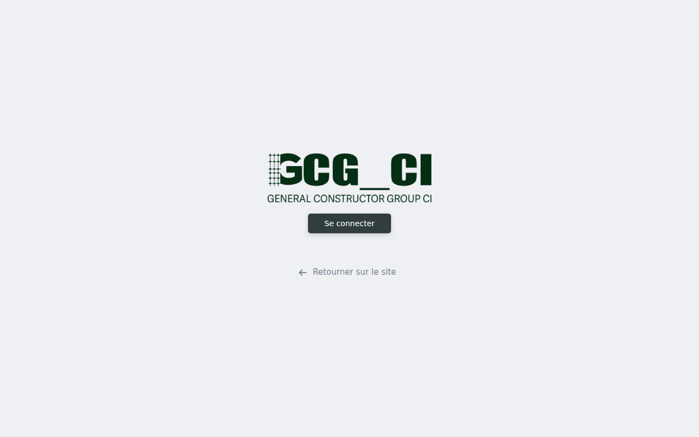
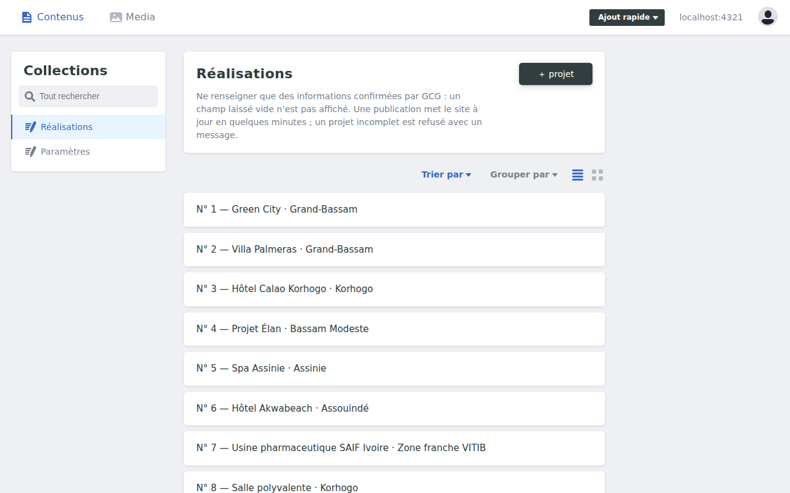
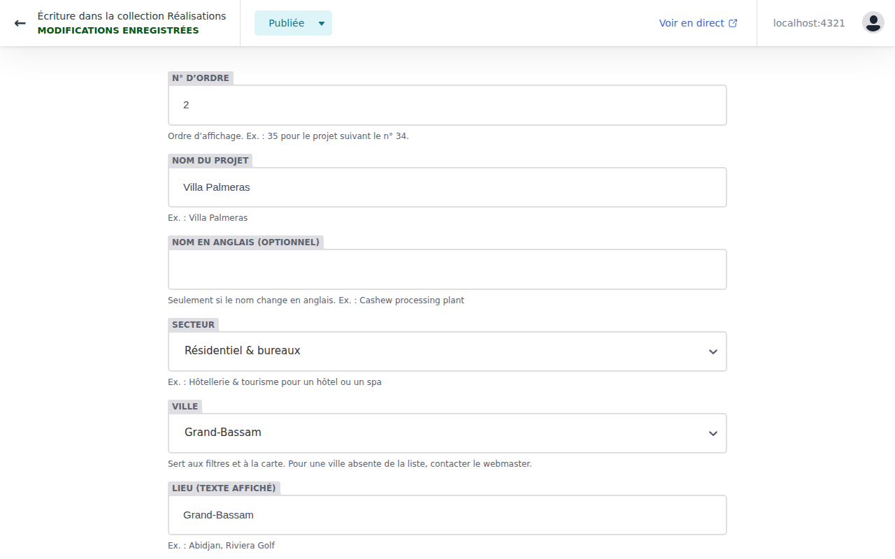
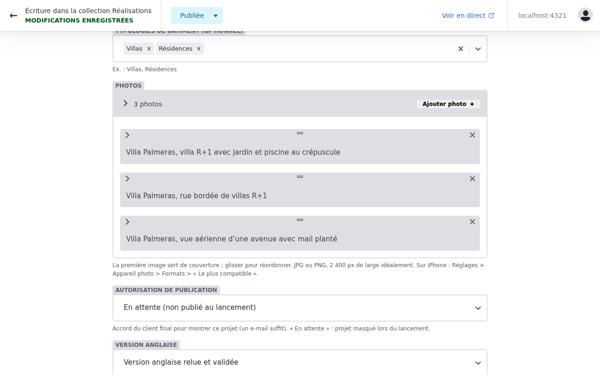
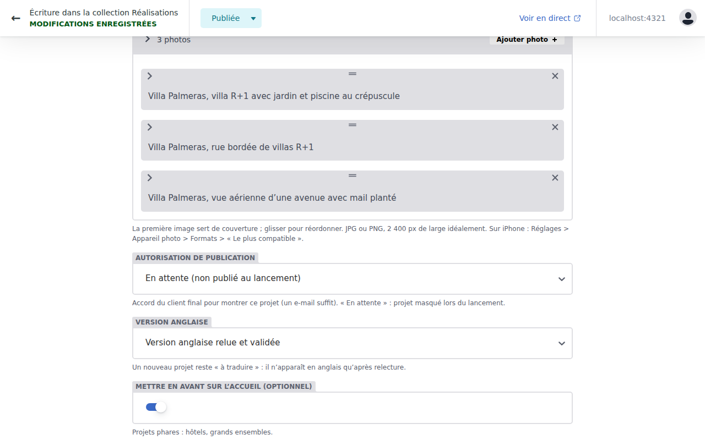
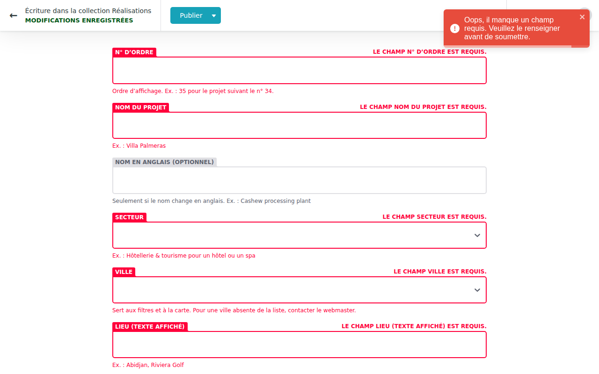
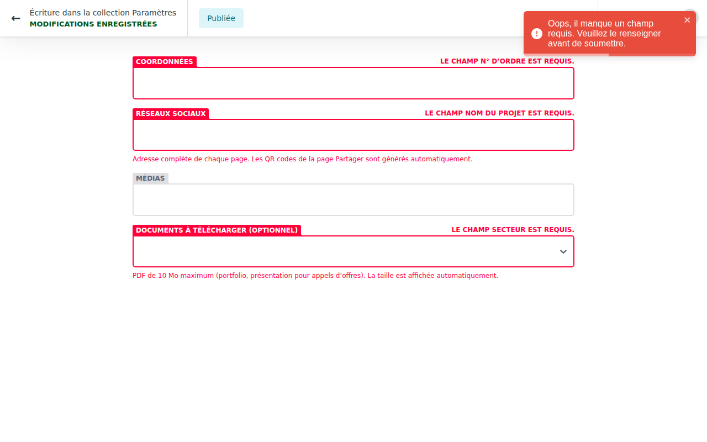
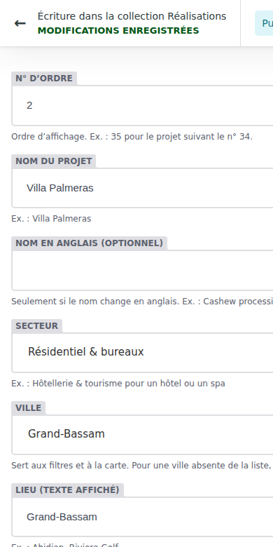

# Guide de l’éditeur : mettre à jour le site GCG

Ce guide s’adresse à la personne de GCG qui ajoute des projets et met à jour les coordonnées.
Aucune connaissance technique n’est nécessaire. Comptez **10 à 15 minutes** pour un projet complet
avec ses photos.

> Les captures ci-dessous viennent de la version de test. En production, l’adresse est
> `https://<domaine-gcg>/admin` et le bouton « Publier » passe par les étapes Brouillon → En cours de révision → Prêt
> (voir l’étape 5).

## 1. Se connecter

1. Ouvrir `https://<domaine-gcg>/admin` sur un ordinateur ou un téléphone.
2. Cliquer sur **Se connecter avec GitHub** et saisir les identifiants GitHub de GCG (compte personnel de
   l’éditeur, avec double authentification).
3. Par sécurité, la session se ferme après **8 heures sans activité**. Il suffit de se reconnecter.



Mot de passe oublié ou code de double authentification perdu : utiliser les codes de secours rangés dans le
coffre de GCG, puis prévenir l’équipe. Ne jamais partager son compte.

## 2. Trouver un projet

La collection **Réalisations** liste les projets dans l’ordre du site (n° 1, 2, 3…). Les boutons en haut
permettent de les trier ou de les regrouper par secteur, statut ou autorisation.



- **Nouveau projet** : bouton en haut de la liste.
- **Modifier** : cliquer sur le projet.
- **Supprimer** : impossible ici, volontairement. Pour retirer un projet, demander à l’équipe (une
  redirection doit être mise en place pour que les liens déjà partagés continuent de fonctionner).

## 3. Remplir la fiche d’un projet

Chaque champ a une phrase d’aide et un exemple. Un champ marqué **(optionnel)** peut rester vide :
il n’apparaît alors pas sur le site. **Ne saisir que des informations confirmées par GCG** (surfaces,
années, statut) : en cas de doute, laisser vide.



| Champ | Ce qu’il faut savoir |
| --- | --- |
| N° d’ordre | Position du projet sur le site. Nouveau projet : le numéro qui suit le dernier. |
| Nom du projet | Nom exact, avec accents. Il sert à créer l’adresse de la page, qui ne changera plus. |
| Secteur, Ville | Listes fermées. Ville absente : demander à l’équipe de l’ajouter (elle apparaîtra sur la carte). |
| Lieu, Période | Ce qui s’affiche : « Abidjan, Riviera Golf » ; « 2024 – 2025 ». |
| Statut | En cours d’études, en cours d’exécution ou réceptionné. Vide si non confirmé. |
| Résumé (français / anglais) | Une ou deux phrases, 300 caractères au plus. |
| Missions GCG | Ce que GCG a réellement fait (études, gros œuvre…). Ne jamais revendiquer une conception faite par un autre. |
| Expertises mobilisées | Le projet apparaît aussi sur la page de chaque expertise cochée. |

Les règles d’écriture (espaces, nombres, termes anglais) sont dans `charte-redactionnelle.md`.
Le site place lui-même les espaces insécables avant `: ; ! ?`.

## 4. Ajouter les photos



1. **Ajouter photo** → **Choisir une image** → **Téléverser** ; on peut sélectionner plusieurs fichiers.
2. Pour chaque photo, écrire une **description** en français et en anglais : ce que montre l’image
   (« Villa Palmeras, façade principale et piscine »). Elle est lue par les personnes malvoyantes et par Google.
3. Indiquer la **nature** : photo réelle, perspective 3D (le site affiche alors « Perspective ») ou plan.
4. **La première photo est la couverture.** Glisser les photos par la poignée `═` pour changer l’ordre.
5. Facultatif : **point focal** (« 50% 30% ») si le recadrage coupe une partie importante.

Formats acceptés : JPG, PNG, WebP ou HEIC (iPhone), 20 Mo au plus, de préférence la photo d’origine
(2 400 px de large ou plus). Le site convertit les photos HEIC en JPG, crée lui-même les versions légères et
retire les données de localisation (GPS). Un autre format (vidéo, PDF, capture renommée) est refusé avec un
message.

- **Photos reçues par WhatsApp** : elles sont fortement compressées ; demander l’original (envoi en
  « Document » ou par e-mail en taille réelle).
- Pas de photos de personnes reconnaissables (ouvriers, clients) sans leur accord écrit, ni de plaques
  d’immatriculation lisibles.
- Ne publier que des photos dont GCG détient les droits (photographe payé, drone de GCG…) : les noter dans
  `registre-des-droits.csv`.

## 5. Autorisation, version anglaise et publication



- **Autorisation de publication** : l’accord du client final (un e-mail suffit, à archiver). Tant qu’il est
  « En attente », le projet n’apparaît pas sur le site de production.
- **Version anglaise** : un nouveau projet est « À traduire ». Sa page anglaise n’est publiée qu’après
  relecture (par GCG ou par l’équipe dans le cadre de la maintenance), quand le statut passe à
  « Version anglaise relue et validée ».

**Publier en production** (circuit de relecture) :

1. **Enregistrer** : la modification devient un **brouillon**, invisible des visiteurs.
2. **Aperçu** : après 2 à 5 minutes, le lien « Voir l’aperçu » ouvre la vraie page sur une adresse de test
   (en français, puis en anglais avec le bouton EN), à regarder sur ordinateur et sur téléphone avant toute
   mise en ligne. *Réglage à faire une fois par l’équipe : `preview_context` dans `public/admin/config.yml`.*
3. Statut **En cours de révision**, puis **Prêt**.
4. **Publier** → **Publier maintenant** : le site est à jour en **2 à 5 minutes**, sans intervention de l’équipe.

L’onglet **Flux éditorial** (en haut) montre les brouillons en cours dans trois colonnes.

## 6. Quand la publication est refusée

Un projet incomplet ne peut pas être publié : le champ manquant est signalé en rouge, avec son nom.
Compléter puis publier à nouveau.



Si la publication a été acceptée mais que le site n’a pas changé après 10 minutes, une vérification
automatique a refusé le contenu (par exemple une photo trop petite) : **le site reste sur la version
précédente**, rien n’est cassé. Prévenir l’équipe, qui reçoit le message d’erreur.

## 7. Revenir en arrière

Chaque publication est conservée. Pour annuler une erreur (texte effacé, mauvaise photo) :

- le plus simple : rouvrir le projet, corriger et republier ;
- sinon, prévenir l’équipe : la version précédente est restaurée en moins de 5 minutes
  (`exploitation.md`, section 2).

## 8. Coordonnées, réseaux sociaux, vidéo et documents

Collection **Paramètres** → **Coordonnées, réseaux et médias**.



- **Téléphone, WhatsApp** : au format international (`+225 07 00 00 00 00`). Le numéro WhatsApp active les
  boutons WhatsApp de tout le site.
- **E-mail, adresse, lien Google Maps, horaires** : le fuseau « GMT, heure d’Abidjan » est ajouté tout seul.
- **Réseaux sociaux** : l’adresse complète de chaque page ; les QR codes de la page Partager se créent seuls.
- **Vidéo de présentation** : lien YouTube ou Vimeo, sous-titrée en français et en anglais.
- **Documents à télécharger** : PDF de 10 Mo au plus, avec titre, langue et version (AAAA-MM).

Un champ vide est masqué sur le site. Les pages légales, les menus et la présentation des expertises ne
sont pas modifiables ici : demander à l’équipe.

## 9. Depuis un téléphone, sur un chantier

L’espace de gestion fonctionne sur téléphone : créer le projet, prendre ou choisir les photos, enregistrer en
brouillon. Compléter les descriptions et publier plus tard depuis un ordinateur si besoin.



## 10. Demander une modification à l’équipe

Canal : groupe WhatsApp « Site GCG » ou e-mail. Réponse sous 2 jours ouvrés. Pour un nouveau projet,
envoyer en un seul message :

```
Projet : <nom exact>
Lieu : <ville, quartier>
Année ou période : <2024 – 2025>
Statut : <études / exécution / réceptionné>
Surface : <m², si connue>
Missions de GCG : <études, gros œuvre, second œuvre, VRD…>
Photos : <lien de partage ; originaux, pas de captures WhatsApp>
Auteur des photos : <nom ; GCG détient-il les droits ?>
Autorisation du client final : <oui (e-mail joint) / en attente>
```

## Aide-mémoire

| Je veux… | Où |
| --- | --- |
| Ajouter un projet | Réalisations → Nouveau projet |
| Changer la photo de couverture | Projet → Photos → glisser la bonne photo en premier |
| Mettre un projet en avant sur l’accueil | Projet → « Mettre en avant sur l’accueil » + ordre |
| Changer le numéro WhatsApp | Paramètres → Coordonnées |
| Ajouter la plaquette PDF | Paramètres → Documents à télécharger |
| Retirer un projet | Demander à l’équipe |
